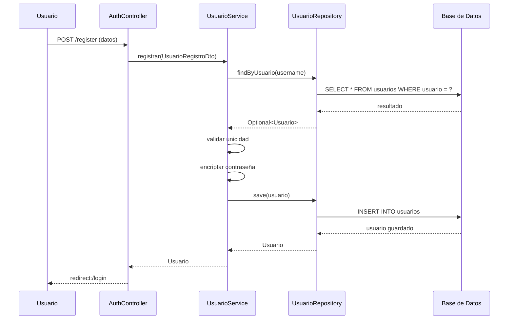
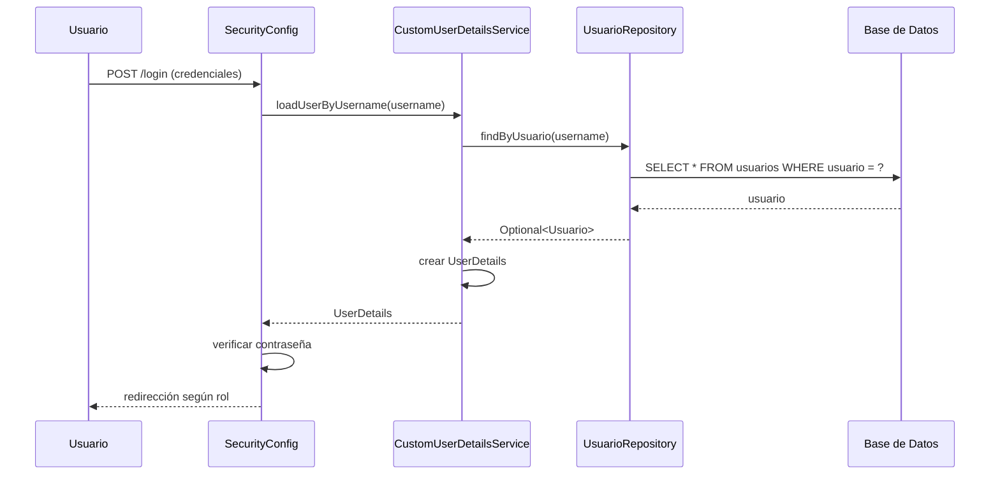
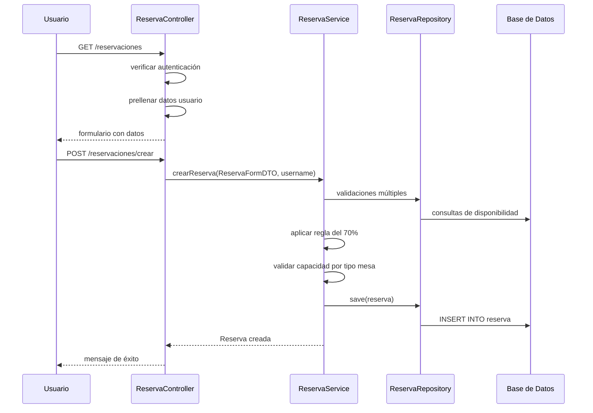
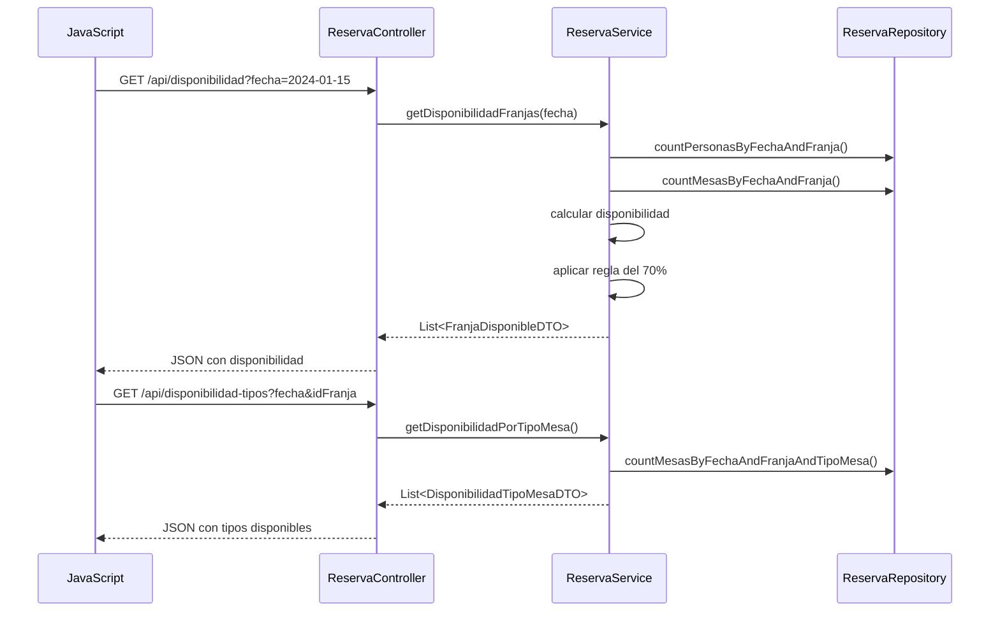

# Documentación Completa - Sistema de Reserva de Mesas "7 Sopas"

## 📋 Índice
1. [Descripción General del Proyecto](#descripción-general-del-proyecto)
2. [Arquitectura y Patrones de Diseño](#arquitectura-y-patrones-de-diseño)
3. [Estructura del Proyecto](#estructura-del-proyecto)
4. [Base de Datos y Persistencia](#base-de-datos-y-persistencia)
5. [Flujo de Funciones](#flujo-de-funciones)
6. [Seguridad](#seguridad)
7. [Tecnologías Utilizadas](#tecnologías-utilizadas)
8. [Guía de Anotaciones](#guía-de-anotaciones)

---

## 🎯 Descripción General del Proyecto

**Sistema de Reserva de Mesas "7 Sopas"** es una aplicación web desarrollada con Spring Boot que permite gestionar reservas de mesas para un restaurante. El sistema implementa funcionalidades para:

- **Usuarios**: Registro, autenticación, gestión de perfil y creación de reservas
- **Administradores**: Gestión completa de reservas con filtros avanzados y reportes
- **Sistema de Franjas Horarias**: Control de disponibilidad por horarios específicos
- **Tipos de Mesa**: Gestión de diferentes categorías de mesas (VIP, familiar, etc.)
- **Validaciones de Negocio**: Regla del 70% de ocupación y control de capacidad

---

## 🏗️ Arquitectura y Patrones de Diseño

### Patrón MVC (Model-View-Controller)

#### **Model (Modelo)**
- **Entidades JPA**: Representan el modelo de datos
  - `Usuario`: Gestión de usuarios del sistema
  - `Reserva`: Información de las reservas
  - `Mesa`: Configuración de mesas físicas
  - `TipoMesa`: Categorías de mesas
  - `ConfiguracionFranja`: Franjas horarias disponibles

#### **View (Vista)**
- **Templates Thymeleaf**: Interfaz de usuario
  - `templates/`: Páginas HTML con Thymeleaf
  - `static/`: Recursos estáticos (CSS, JS, imágenes)

#### **Controller (Controlador)**
- **Controllers Spring**: Gestión de peticiones HTTP
  - `ReservaController`: Gestión de reservas
  - `AuthController`: Autenticación y registro
  - `AdminController`: Panel administrativo
  - `ProfileController`: Gestión de perfiles

### Patrón DTO (Data Transfer Object)

Los DTOs se utilizan para transferir datos entre capas sin exponer las entidades directamente:

```java
// Ejemplo: ReservaFormDTO
@Data
public class ReservaFormDTO {
    private String nombreCliente;
    private String correoCliente;
    private String telefonoCliente;
    private String comentarios;
    private String fecha;
    private Integer numeroPersonas;
    private Integer idFranja;
    private Integer idTipoMesa;
}
```

**Ventajas del patrón DTO:**
- Desacopla la capa de presentación del modelo de datos
- Permite validaciones específicas por formulario
- Facilita el manejo de datos complejos en formularios
- Mejora la seguridad al no exponer entidades completas

### Patrón DAO (Data Access Object) / Repository

Spring Data JPA implementa automáticamente el patrón DAO a través de interfaces Repository:

```java
@Repository
public interface UsuarioRepository extends JpaRepository<Usuario, Integer> {
    /**
     * Busca un usuario por su nombre de usuario.
     * Spring Data JPA creará la implementación automáticamente.
     */
    Optional<Usuario> findByUsuario(String usuario);
    
    /**
     * Busca un usuario por su correo electrónico.
     */
    Optional<Usuario> findByCorreo(String correo);
}
```

**Características del patrón Repository:**
- Abstrae el acceso a datos
- Spring Data JPA genera automáticamente las implementaciones
- Métodos de consulta derivados del nombre del método
- Soporte para consultas personalizadas con `@Query`

### Patrón Service (Capa de Servicio)

La capa de servicio contiene la lógica de negocio:

```java
@Service
public class UsuarioService {
    
    private final UsuarioRepository usuarioRepository;
    private final PasswordEncoder passwordEncoder;

    /**
     * Registra un nuevo usuario aplicando validaciones de negocio
     */
    public Usuario registrar(UsuarioRegistroDto registroDTO) {
        // Validaciones de negocio
        if (usuarioRepository.findByUsuario(registroDTO.getUsuario()).isPresent()) {
            throw new IllegalStateException("El nombre de usuario ya está en uso.");
        }
        
        // Lógica de creación
        Usuario usuario = new Usuario();
        usuario.setContrasena(passwordEncoder.encode(registroDTO.getContrasena()));
        return usuarioRepository.save(usuario);
    }
}
```

---

## 📁 Estructura del Proyecto

```
src/main/java/com/example/demo/
├── Controller/          # Controladores MVC
│   ├── ReservaController.java
│   ├── AuthController.java
│   ├── AdminController.java
│   └── ProfileController.java
├── Services/           # Lógica de negocio
│   ├── ReservaService.java
│   ├── UsuarioService.java
│   └── CustomUserDetailsService.java
├── Repository/         # Acceso a datos (DAO)
│   ├── ReservaRepository.java
│   ├── UsuarioRepository.java
│   └── MesaRepository.java
├── Entities/          # Modelos de datos (JPA)
│   ├── Usuario.java
│   ├── Reserva.java
│   ├── Mesa.java
│   └── TipoMesa.java
├── dto/               # Data Transfer Objects
│   ├── ReservaFormDTO.java
│   ├── UsuarioRegistroDto.java
│   └── DisponibilidadTipoMesaDTO.java
├── security/          # Configuración de seguridad
│   ├── SecurityConfig.java
│   └── DataInitializer.java
└── DemoApplication.java
```

---

## 🗄️ Base de Datos y Persistencia

### Configuración de Base de Datos

**Tipo**: H2 Database (Base de datos en memoria persistida en archivo)
**Configuración** (`application.properties`):

```properties
# Base de Datos H2 Persistente
spring.datasource.url=jdbc:h2:file:./sietesopasdb
spring.datasource.driverClassName=org.h2.Driver
spring.datasource.username=sa
spring.datasource.password=
spring.h2.console.enabled=true
spring.jpa.hibernate.ddl-auto=update
spring.jpa.show-sql=true
```

### Modelo de Datos

#### Tabla `Usuarios`
```sql
CREATE TABLE Usuarios (
  idUsuario INT AUTO_INCREMENT PRIMARY KEY,
  nombreCompleto VARCHAR(255) NOT NULL,
  correo VARCHAR(255) UNIQUE NOT NULL,
  telefono VARCHAR(50),
  usuario VARCHAR(50),
  contrasena VARCHAR(255) NOT NULL,
  rol VARCHAR(50) NOT NULL
);
```

#### Tabla `Reserva`
```sql
CREATE TABLE Reserva (
    idReserva INT AUTO_INCREMENT PRIMARY KEY,
    nombreCliente VARCHAR(255) NOT NULL,
    correoCliente VARCHAR(255) NOT NULL,
    telefonoCliente VARCHAR(20),
    fecha DATE NOT NULL,
    numeroPersonas INT NOT NULL,
    estado VARCHAR(50) NOT NULL,
    comentarios TEXT,
    idFranja INT NOT NULL,
    idUsuario INT,
    idTipoMesa INT NOT NULL,
    FOREIGN KEY (idFranja) REFERENCES ConfiguracionFranja(idFranja),
    FOREIGN KEY (idUsuario) REFERENCES Usuarios(idUsuario),
    FOREIGN KEY (idTipoMesa) REFERENCES TipoMesa(idTipoMesa)
);
```

### Relaciones entre Entidades

1. **Usuario (1) → Reserva (N)**: Un usuario puede tener múltiples reservas
2. **TipoMesa (1) → Reserva (N)**: Un tipo de mesa puede tener múltiples reservas
3. **ConfiguracionFranja (1) → Reserva (N)**: Una franja puede tener múltiples reservas
4. **TipoMesa (1) → Mesa (N)**: Un tipo de mesa tiene múltiples mesas físicas

### Persistencia de Datos

**JPA/Hibernate** maneja la persistencia automáticamente:

1. **Entidades JPA**: Clases anotadas con `@Entity`
2. **Repositorios**: Interfaces que extienden `JpaRepository`
3. **Transacciones**: Gestionadas con `@Transactional`

---

## 🔄 Flujo de Funciones

### 1. Registro de Usuario



**Paso a paso:**
1. Usuario envía formulario de registro
2. `AuthController` recibe los datos en un `UsuarioRegistroDto`
3. `UsuarioService` valida que el usuario y correo sean únicos
4. Se encripta la contraseña con `BCryptPasswordEncoder`
5. Se guarda en base de datos mediante `UsuarioRepository`
6. Redirección a página de login

### 2. Autenticación de Usuario



### 3. Creación de Reserva



**Validaciones aplicadas:**
1. **Usuario autenticado**: Solo usuarios registrados pueden reservar
2. **Una reserva por día**: Un usuario no puede tener múltiples reservas el mismo día
3. **Regla del 70%**: Si una franja está al 70% de capacidad, no acepta más reservas
4. **Disponibilidad por tipo de mesa**: Verificar mesas disponibles del tipo seleccionado
5. **Capacidad total**: Verificar que no se exceda la capacidad máxima de la franja

### 4. Consulta de Disponibilidad (API REST)



---

## 🔐 Seguridad

### Configuración de Spring Security

**Clase**: `SecurityConfig.java`

#### Autenticación
- **Proveedor**: `DaoAuthenticationProvider`
- **UserDetailsService**: `CustomUserDetailsService`
- **Encriptación**: `BCryptPasswordEncoder`

#### Autorización por Rutas
```java
.authorizeHttpRequests(authorize -> authorize
    // Rutas públicas
    .requestMatchers("/", "/register", "/login", "/css/**", "/js/**", "/images/**").permitAll()
    .requestMatchers("/menu", "/nosotros").permitAll()
    
    // Rutas que requieren autenticación
    .requestMatchers("/reservaciones", "/perfil").authenticated()
    
    // Rutas solo para administradores
    .requestMatchers("/admin/**").hasRole("ADMIN")
    
    .anyRequest().authenticated()
)
```

#### Gestión de Roles
- **USER**: Usuarios regulares (pueden crear reservas)
- **ADMIN**: Administradores (acceso total al sistema)

#### Redirección Post-Login
```java
@Bean
public AuthenticationSuccessHandler myAuthenticationSuccessHandler(){
    return new AuthenticationSuccessHandler() {
        @Override
        public void onAuthenticationSuccess(...) {
            boolean isAdmin = authentication.getAuthorities().stream()
                    .anyMatch(grantedAuthority -> 
                        grantedAuthority.getAuthority().equals("ROLE_ADMIN"));
            
            if (isAdmin) {
                response.sendRedirect("/admin");
            } else {
                response.sendRedirect("/");
            }
        }
    };
}
```

---

## 🛠️ Tecnologías Utilizadas

### Backend
- **Spring Boot 3.4.4**: Framework principal
- **Spring Data JPA**: Persistencia de datos
- **Spring Security**: Autenticación y autorización
- **H2 Database**: Base de datos en memoria
- **Lombok**: Reducir código boilerplate
- **Spring Validation**: Validación de datos

### Frontend
- **Thymeleaf**: Motor de templates
- **HTML5/CSS3**: Estructura y estilos
- **JavaScript**: Interactividad del lado cliente
- **Bootstrap** (implícito): Framework CSS

### Herramientas de Desarrollo
- **Maven**: Gestión de dependencias
- **Java 17**: Versión del lenguaje
- **Spring Boot DevTools**: Desarrollo en caliente

---

## 📊 Reglas de Negocio Implementadas

### 1. Regla del 70%
Si una franja horaria alcanza el 70% de su capacidad de personas, no acepta más reservas.

### 2. Una Reserva por Usuario por Día
Un usuario autenticado no puede crear múltiples reservas para la misma fecha.

### 3. Gestión de Mesas por Tipo
- 5 mesas iniciales por cada tipo de mesa
- Las reservas se asignan por tipo de mesa específico
- Validación de disponibilidad por tipo antes de confirmar

### 4. Estados de Reserva
- **CONFIRMADA**: Reserva activa
- **CANCELADA**: Reserva cancelada por el admin
- **COMPLETADA**: Reserva finalizada

---

## 🏷️ Guía de Anotaciones

Para entender completamente el código del proyecto, especialmente las anotaciones de Spring, JPA, Lombok y otras tecnologías, consulta el archivo:

**`GUIA_ANOTACIONES_TECNOLOGIAS.md`**

Esta guía explica en detalle:

### Anotaciones de Lombok
- **`@Data`**: Genera automáticamente getters, setters, toString, equals, hashCode
- **Ventaja**: Reduce código boilerplate significativamente

### Anotaciones de JPA
- **`@Entity`**: Marca una clase como tabla de base de datos
- **`@Table(name = "tabla")`**: Especifica el nombre de la tabla
- **`@Id`**: Define la clave primaria
- **`@GeneratedValue(strategy = GenerationType.IDENTITY)`**: Auto-incremento del ID
- **`@Column`**: Configura propiedades de columnas (unique, nullable, etc.)
- **`@ManyToOne`**: Define relaciones entre entidades

### Anotaciones de Spring
- **`@Service`**: Marca servicios con lógica de negocio
- **`@Repository`**: Marca repositorios de acceso a datos
- **`@Controller`**: Marca controladores web
- **`@GetMapping`/`@PostMapping`**: Define endpoints HTTP
- **`@Transactional`**: Garantiza operaciones atómicas en BD

### Funciones de Spring Data JPA
- **Métodos automáticos**: save(), findById(), findAll(), delete()
- **Consultas derivadas**: findByUsuario(), findByCorreo()
- **Consultas personalizadas**: @Query con JPQL

### Tecnologías Frontend
- **Thymeleaf**: Templates dinámicos con sintaxis th:*
- **AJAX/JavaScript**: Peticiones asíncronas sin recargar página

### Spring Security
- **Configuración de rutas**: públicas, autenticadas, por roles
- **Inyección de Authentication**: obtener usuario actual
- **Encriptación BCrypt**: seguridad de contraseñas

---

Esta documentación proporciona una visión completa del sistema, sus patrones de diseño, flujos de datos y reglas de negocio implementadas. El proyecto demuestra una aplicación bien estructurada siguiendo las mejores prácticas de Spring Boot y patrones de diseño empresariales.
