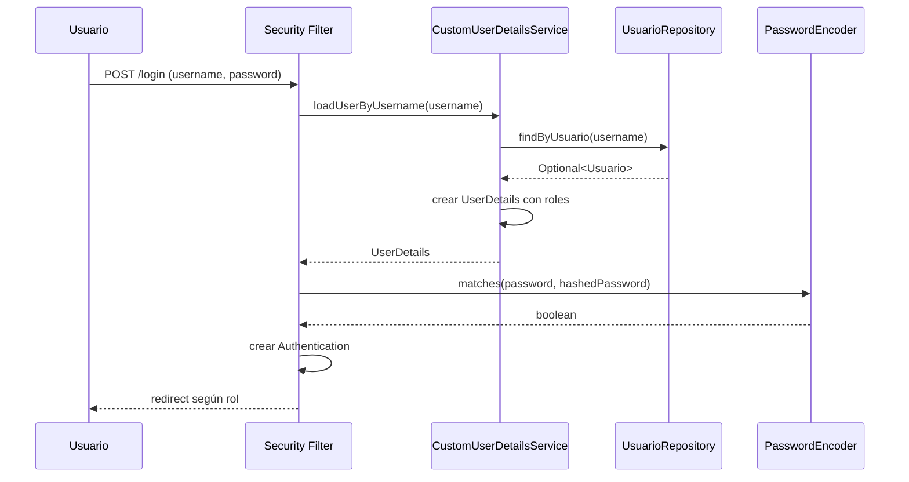

# Documentación Técnica - Flujo de Datos y Comunicación

## 📊 Flujo de Datos en el Sistema

### 1. Arquitectura de Capas

```
┌─────────────────────────────────────────────────────────────┐
│                    CAPA DE PRESENTACIÓN                     │
│  ┌─────────────────┐  ┌─────────────────┐  ┌──────────────┐ │
│  │  Templates      │  │   Static Files  │  │   DTOs       │ │
│  │  (Thymeleaf)    │  │   (CSS, JS)     │  │              │ │
│  └─────────────────┘  └─────────────────┘  └──────────────┘ │
└─────────────────────────────────────────────────────────────┘
                               │
                               ▼
┌─────────────────────────────────────────────────────────────┐
│                     CAPA DE CONTROL                        │
│  ┌─────────────────┐  ┌─────────────────┐  ┌──────────────┐ │
│  │ Controllers     │  │  Security       │  │  REST APIs   │ │
│  │                 │  │  Config         │  │              │ │
│  └─────────────────┘  └─────────────────┘  └──────────────┘ │
└─────────────────────────────────────────────────────────────┘
                               │
                               ▼
┌─────────────────────────────────────────────────────────────┐
│                    CAPA DE NEGOCIO                         │
│  ┌─────────────────┐  ┌─────────────────┐  ┌──────────────┐ │
│  │   Services      │  │  Validaciones   │  │   Lógica     │ │
│  │                 │  │   de Negocio    │  │   Compleja   │ │
│  └─────────────────┘  └─────────────────┘  └──────────────┘ │
└─────────────────────────────────────────────────────────────┘
                               │
                               ▼
┌─────────────────────────────────────────────────────────────┐
│                   CAPA DE PERSISTENCIA                     │
│  ┌─────────────────┐  ┌─────────────────┐  ┌──────────────┐ │
│  │  Repositories   │  │   Entities      │  │   Database   │ │
│  │   (Spring       │  │   (JPA)         │  │   (H2)       │ │
│  │   Data JPA)     │  │                 │  │              │ │
│  └─────────────────┘  └─────────────────┘  └──────────────┘ │
└─────────────────────────────────────────────────────────────┘
```

---

## 🔄 Comunicación entre Componentes

### 1. Flujo de Creación de Reserva

#### Paso 1: Solicitud HTTP
```http
POST /reservaciones/crear
Content-Type: application/x-www-form-urlencoded

nombreCliente=Juan+Perez&correoCliente=juan@email.com&fecha=2024-01-15...
```

#### Paso 2: Procesamiento en Controller
```java
@PostMapping("/reservaciones/crear")
public String procesarReserva(@ModelAttribute("reservaForm") ReservaFormDTO formDTO,
                             Authentication authentication,
                             RedirectAttributes redirectAttributes) {
    
    // 1. Validación de autenticación
    if (authentication == null || !authentication.isAuthenticated()) {
        return "redirect:/login";
    }
    
    // 2. Delegación a la capa de servicio
    try {
        String username = authentication.getName();
        reservaService.crearReserva(formDTO, username);
        
        // 3. Manejo de respuesta exitosa
        redirectAttributes.addFlashAttribute("successMessage", 
            "¡Tu reserva ha sido confirmada exitosamente!");
    } catch (IllegalStateException e) {
        // 4. Manejo de errores de negocio
        redirectAttributes.addFlashAttribute("errorMessage", 
            "Error al crear la reserva: " + e.getMessage());
    }
    
    return "redirect:/reservaciones";
}
```

#### Paso 3: Procesamiento en Service Layer
```java
@Transactional
public Reserva crearReserva(ReservaFormDTO formDTO, String username) {
    
    // 1. Validación de usuario
    Usuario usuario = usuarioRepository.findByUsuario(username)
            .orElseThrow(() -> new IllegalStateException("Usuario no autenticado."));

    // 2. Conversión de datos
    LocalDate fechaReserva = LocalDate.parse(formDTO.getFecha(), 
                                           DateTimeFormatter.ISO_LOCAL_DATE);

    // 3. Validaciones de negocio
    if (!reservaRepository.findByUsuarioAndFecha(usuario, fechaReserva).isEmpty()) {
        throw new IllegalStateException("Ya tienes una reserva para este día.");
    }
    
    // 4. Aplicación de regla del 70%
    ConfiguracionFranja franja = franjaRepository.findById(formDTO.getIdFranja())
            .orElseThrow(() -> new IllegalStateException("Franja no encontrada"));
    
    Integer personasOcupadas = reservaRepository
        .countPersonasByFechaAndFranja(fechaReserva, formDTO.getIdFranja());
    personasOcupadas = (personasOcupadas == null) ? 0 : personasOcupadas;
    
    boolean estaCasiLleno = (double) personasOcupadas / franja.getCapacidadMaxima() >= 0.7;
    if (estaCasiLleno) {
        throw new IllegalStateException(
            "Esta franja horaria ya está casi llena y no acepta más reservas.");
    }

    // 5. Validación de disponibilidad por tipo de mesa
    int mesasRequeridas = formDTO.getNumeroPersonas() <= 5 ? 1 : 2;
    Integer mesasOcupadasDelTipo = reservaRepository
        .countMesasByFechaAndFranjaAndTipoMesa(fechaReserva, 
                                             formDTO.getIdFranja(), 
                                             formDTO.getIdTipoMesa());
    mesasOcupadasDelTipo = (mesasOcupadasDelTipo == null) ? 0 : mesasOcupadasDelTipo;
    int mesasDisponiblesDelTipo = 5 - mesasOcupadasDelTipo; // 5 mesas por tipo
    
    if (mesasRequeridas > mesasDisponiblesDelTipo) {
        throw new IllegalStateException(
            "No hay suficientes mesas del tipo seleccionado.");
    }

    // 6. Creación y persistencia
    Reserva nuevaReserva = new Reserva();
    // ... seteo de propiedades ...
    
    return reservaRepository.save(nuevaReserva);
}
```

#### Paso 4: Persistencia en Base de Datos
```sql
-- 1. Consultas de validación
SELECT COUNT(*) FROM Reserva 
WHERE idUsuario = ? AND fecha = ? AND estado = 'CONFIRMADA';

SELECT SUM(numeroPersonas) FROM Reserva 
WHERE fecha = ? AND idFranja = ? AND estado = 'CONFIRMADA';

-- 2. Inserción de nueva reserva
INSERT INTO Reserva (nombreCliente, correoCliente, telefonoCliente, 
                     fecha, numeroPersonas, estado, comentarios, 
                     idFranja, idUsuario, idTipoMesa) 
VALUES (?, ?, ?, ?, ?, 'CONFIRMADA', ?, ?, ?, ?);
```

---

## 📡 APIs REST para Consultas Dinámicas

### 1. Consulta de Disponibilidad de Franjas

#### Request:
```javascript
// Llamada desde JavaScript en el frontend
fetch(`/api/disponibilidad?fecha=${fechaSeleccionada}`)
    .then(response => response.json())
    .then(data => {
        // Procesar datos de disponibilidad
        actualizarOpcionesFranjas(data);
    });
```

#### Processing:
```java
@GetMapping("/api/disponibilidad")
@ResponseBody
public List<FranjaDisponibleDTO> getDisponibilidad(@RequestParam String fecha) {
    LocalDate fechaSeleccionada = LocalDate.parse(fecha);
    return reservaService.getDisponibilidadFranjas(fechaSeleccionada);
}
```

#### Response:
```json
[
  {
    "idFranja": 1,
    "franjaHoraria": "10:00 - 12:00",
    "mesasDisponibles": 15,
    "personasDisponibles": 45,
    "casiLleno": false
  },
  {
    "idFranja": 2,
    "franjaHoraria": "12:30 - 14:30",
    "mesasDisponibles": 8,
    "personasDisponibles": 20,
    "casiLleno": true
  }
]
```

### 2. Consulta de Tipos de Mesa Disponibles

#### Request:
```javascript
fetch(`/api/disponibilidad-tipos?fecha=${fecha}&idFranja=${idFranja}`)
    .then(response => response.json())
    .then(data => {
        actualizarTiposMesa(data);
    });
```

#### Response:
```json
[
  {
    "idTipoMesa": 1,
    "nombre": "VIP",
    "mesasDisponibles": 3
  },
  {
    "idTipoMesa": 2,
    "nombre": "Familiar",
    "mesasDisponibles": 0
  },
  {
    "idTipoMesa": 3,
    "nombre": "Terraza",
    "mesasDisponibles": 4
  }
]
```

---

## 🔐 Flujo de Autenticación

### 1. Proceso de Login



### 2. Manejo de Sesiones

```java
// En SecurityConfig.java
@Bean
public AuthenticationSuccessHandler myAuthenticationSuccessHandler(){
    return new AuthenticationSuccessHandler() {
        @Override
        public void onAuthenticationSuccess(HttpServletRequest request, 
                                          HttpServletResponse response, 
                                          Authentication authentication) {
            
            // Verificar rol del usuario autenticado
            boolean isAdmin = authentication.getAuthorities().stream()
                    .anyMatch(grantedAuthority -> 
                        grantedAuthority.getAuthority().equals("ROLE_ADMIN"));
            
            // Redirección basada en rol
            if (isAdmin) {
                response.sendRedirect("/admin");
            } else {
                response.sendRedirect("/");
            }
        }
    };
}
```

---

## 💾 Gestión de Transacciones

### 1. Anotación @Transactional

```java
@Service
public class ReservaService {
    
    // Transacción para operaciones de escritura
    @Transactional
    public Reserva crearReserva(ReservaFormDTO formDTO, String username) {
        // Múltiples operaciones en una sola transacción:
        // 1. Validaciones (SELECT queries)
        // 2. Creación de entidad
        // 3. Guardado (INSERT)
        
        // Si cualquier operación falla, toda la transacción se revierte
    }
    
    // Transacción de solo lectura (optimización)
    @Transactional(readOnly = true)
    public List<FranjaDisponibleDTO> getDisponibilidadFranjas(LocalDate fecha) {
        // Solo consultas SELECT
        // Mejora performance al no necesitar control de escritura
    }
}
```

### 2. Manejo de Conexiones

```properties
# En application.properties
# Configuración del pool de conexiones HikariCP
spring.datasource.type=com.zaxxer.hikari.HikariDataSource
spring.datasource.hikari.maximum-pool-size=5

# Configuración JPA
spring.jpa.hibernate.ddl-auto=update
spring.jpa.show-sql=true
```

---

## 📋 Validaciones y Reglas de Negocio

### 1. Validaciones en Capas

#### Controller Layer:
```java
// Validación de autenticación
if (authentication == null || !authentication.isAuthenticated()) {
    return "redirect:/login";
}
```

#### Service Layer:
```java
// Validaciones de negocio complejas
if (!reservaRepository.findByUsuarioAndFecha(usuario, fechaReserva).isEmpty()) {
    throw new IllegalStateException("Ya tienes una reserva para este día.");
}

// Regla del 70%
boolean estaCasiLleno = (double) personasOcupadas / franja.getCapacidadMaxima() >= 0.7;
if (estaCasiLleno) {
    throw new IllegalStateException("Franja casi llena");
}
```

#### Repository Layer:
```java
// Validaciones de integridad referencial (JPA automático)
@ManyToOne
@JoinColumn(name = "idFranja", nullable = false)
private ConfiguracionFranja franja;
```

### 2. Propagación de Errores

```java
Controller → Service → Repository → Database
    ↓         ↓         ↓           ↓
  HTTP     Business   Data      Constraint
Response   Logic    Validation   Validation
 (500)   Exception  Exception   SQLException
```

Esta documentación técnica muestra cómo fluyen los datos a través de todas las capas del sistema, desde la interfaz de usuario hasta la base de datos, y cómo se comunican los diferentes componentes entre sí.
