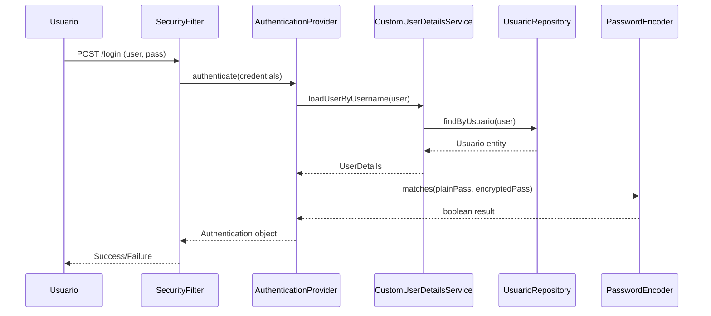

# Guía de Anotaciones y Tecnologías - Sistema "7 Sopas"

## 📚 Explicación de Anotaciones y Funciones

Esta guía explica todas las anotaciones, tecnologías y funciones utilizadas en el proyecto para que cualquier desarrollador pueda entender el código sin conocimiento previo de estas tecnologías.

---

## 🏷️ Anotaciones de Lombok

### `@Data`

```java
@Data
public class Usuario {
    private String nombre;
    private String correo;
}
```

**¿Qué hace?**

- **Genera automáticamente** todos los métodos comunes de una clase:
  - `getName()`, `setNombre()` (getters y setters)
  - `toString()` - para imprimir el objeto
  - `equals()` - para comparar objetos
  - `hashCode()` - para usar en colecciones

**Sin @Data tendrías que escribir:**

```java
public class Usuario {
    private String nombre;

    public String getNombre() { return nombre; }
    public void setNombre(String nombre) { this.nombre = nombre; }

    @Override
    public String toString() {
        return "Usuario{nombre='" + nombre + "'}";
    }
    // ... más código boilerplate
}
```

**Ventaja:** Reduce el código de 50+ líneas a solo la anotación.

---

## 🗄️ Anotaciones de JPA (Java Persistence API)

### `@Entity`

```java
@Entity
public class Usuario {
    // campos de la clase
}
```

**¿Qué hace?**

- Le dice a **Hibernate/JPA** que esta clase representa una **tabla en la base de datos**
- Cada objeto de esta clase = una fila en la tabla
- JPA creará automáticamente la tabla si no existe

### `@Table(name = "nombre_tabla")`

```java
@Entity
@Table(name = "Usuarios")
public class Usuario {
    // campos
}
```

**¿Qué hace?**

- Especifica el **nombre exacto de la tabla** en la base de datos
- Sin esta anotación, JPA usaría el nombre de la clase como nombre de tabla
- Útil cuando queremos un nombre específico para la tabla

### `@Id`

```java
@Entity
public class Usuario {
    @Id
    private Integer idUsuario;
}
```

**¿Qué hace?**

- Marca el campo como **clave primaria** de la tabla
- Identifica únicamente cada registro en la base de datos
- **Obligatorio** en toda entidad JPA

### `@GeneratedValue(strategy = GenerationType.IDENTITY)`

```java
@Id
@GeneratedValue(strategy = GenerationType.IDENTITY)
private Integer idUsuario;
```

**¿Qué hace?**

- Le dice a la base de datos que genere automáticamente el valor del ID
- `IDENTITY` significa que la base de datos usará AUTO_INCREMENT
- No necesitas asignar manualmente el ID al crear un objeto

**Ejemplo práctico:**

```java
Usuario usuario = new Usuario();
usuario.setNombre("Juan");
// NO necesitas: usuario.setIdUsuario(1);
repository.save(usuario); // La BD asigna automáticamente ID = 1, 2, 3...
```

### `@Column`

```java
@Column(name = "correo", unique = true, nullable = false)
private String correo;
```

**¿Qué hace?**

- `name = "correo"`: Nombre exacto de la columna en la BD
- `unique = true`: No puede haber valores duplicados
- `nullable = false`: Campo obligatorio (no puede estar vacío)

### `@ManyToOne`

```java
@ManyToOne
@JoinColumn(name = "idTipoMesa", nullable = false)
private TipoMesa tipoMesa;
```

**¿Qué hace?**

- Define una relación de **muchos a uno**
- Muchas reservas pueden tener el mismo tipo de mesa
- `@JoinColumn`: especifica la columna que hace la unión (foreign key)

**En términos simples:**

- Una reserva tiene un tipo de mesa específico
- Un tipo de mesa puede estar en muchas reservas

---

## 🔧 Anotaciones de Spring Framework

### `@Service`

```java
@Service
public class UsuarioService {
    // lógica de negocio
}
```

**¿Qué hace?**

- Marca la clase como un **servicio de Spring**
- Spring creará automáticamente una instancia de esta clase
- Contiene la **lógica de negocio** de la aplicación
- Se puede inyectar en otras clases

### `@Repository`

```java
@Repository
public interface UsuarioRepository extends JpaRepository<Usuario, Integer> {
    Optional<Usuario> findByUsuario(String usuario);
}
```

**¿Qué hace?**

- Marca la interfaz como un **repositorio de datos**
- Spring Data JPA creará automáticamente la implementación
- Proporciona métodos para acceder a la base de datos

### `@Controller`

```java
@Controller
public class ReservaController {
    // manejo de peticiones web
}
```

**¿Qué hace?**

- Marca la clase como un **controlador web**
- Maneja las peticiones HTTP (GET, POST)
- Devuelve páginas web (templates) al navegador

### `@GetMapping` / `@PostMapping`

```java
@Controller
public class ReservaController {

    @GetMapping("/reservaciones")
    public String mostrarFormulario() {
        return "reservaciones"; // devuelve reservaciones.html
    }

    @PostMapping("/reservaciones/crear")
    public String crearReserva() {
        // procesar formulario
        return "redirect:/reservaciones";
    }
}
```

**¿Qué hace?**

- `@GetMapping`: Maneja peticiones GET (cuando navegas a una página)
- `@PostMapping`: Maneja peticiones POST (cuando envías un formulario)
- El valor dentro es la **URL** que activará este método

### `@ResponseBody`

```java
@GetMapping("/api/disponibilidad")
@ResponseBody
public List<FranjaDisponibleDTO> getDisponibilidad() {
    return listaFranjas; // Devuelve JSON, no HTML
}
```

**¿Qué hace?**

- En lugar de devolver una página HTML, devuelve **datos puros** (JSON)
- Usado para **APIs REST** que consumen JavaScript

### `@Transactional`

```java
@Transactional
public void crearReserva() {
    // múltiples operaciones de BD
}
```

**¿Qué hace?**

- Asegura que **todas las operaciones de base de datos** se ejecuten correctamente
- Si algo falla, **revierte todos los cambios** (rollback)
- Garantiza consistencia de datos

**Ejemplo práctico:**

```java
@Transactional
public void transferirDinero(int de, int para, double cantidad) {
    retirar(de, cantidad);      // Si esto funciona
    depositar(para, cantidad);  // Pero esto falla
    // Automáticamente revierte el retiro
}
```

---

## 🔐 Anotaciones de Spring Security

### `@Configuration`

```java
@Configuration
@EnableWebSecurity
public class SecurityConfig {
    // configuración de seguridad
}
```

**¿Qué hace?**

- `@Configuration`: Marca la clase como configuración de Spring
- `@EnableWebSecurity`: Activa la seguridad web de Spring

### `@Bean`

```java
@Bean
public PasswordEncoder passwordEncoder() {
    return new BCryptPasswordEncoder();
}
```

**¿Qué hace?**

- Crea un **objeto que Spring puede usar** en toda la aplicación
- En este caso, un codificador de contraseñas que las encripta

---

## 🛡️ Spring Security - Documentación Detallada

### ¿Qué es Spring Security?

Spring Security es un framework de seguridad que proporciona **autenticación** (quién eres) y **autorización** (qué puedes hacer) para aplicaciones Java. Es altamente personalizable y se integra perfectamente con Spring Boot.

---

## 🔐 Conceptos Fundamentales

### 1. **Autenticación vs Autorización**

```java
// AUTENTICACIÓN: ¿Quién eres?
Authentication authentication = SecurityContextHolder.getContext().getAuthentication();
String username = authentication.getName(); // "juan123"

// AUTORIZACIÓN: ¿Qué puedes hacer?
boolean isAdmin = authentication.getAuthorities().stream()
    .anyMatch(authority -> authority.getAuthority().equals("ROLE_ADMIN"));
```

**Autenticación:** Verificar la identidad del usuario (usuario + contraseña)
**Autorización:** Verificar qué permisos tiene el usuario (roles y permisos)

### 2. **Principales Componentes**

#### **SecurityFilterChain**

Es la cadena de filtros que procesa cada petición HTTP antes de llegar al controlador.

```java
@Bean
public SecurityFilterChain securityFilterChain(HttpSecurity http) throws Exception {
    http
        .authorizeHttpRequests(authorize -> authorize
            .requestMatchers("/", "/login").permitAll()     // Rutas públicas
            .requestMatchers("/admin/**").hasRole("ADMIN")  // Solo admins
            .anyRequest().authenticated()                   // Todo lo demás requiere login
        )
        .formLogin(form -> form
            .loginPage("/login")                            // Página personalizada de login
            .defaultSuccessUrl("/")                         // Redirección tras login exitoso
        );
    return http.build();
}
```

#### **UserDetailsService**

Interfaz que Spring Security usa para cargar información del usuario.

```java
@Service
public class CustomUserDetailsService implements UserDetailsService {

    private final UsuarioRepository usuarioRepository;

    @Override
    public UserDetails loadUserByUsername(String username) throws UsernameNotFoundException {
        // 1. Buscar usuario en la base de datos
        Usuario usuario = usuarioRepository.findByUsuario(username)
            .orElseThrow(() -> new UsernameNotFoundException("Usuario no encontrado: " + username));

        // 2. Convertir Usuario a UserDetails (formato que entiende Spring Security)
        return User.builder()
            .username(usuario.getUsuario())
            .password(usuario.getContrasena())              // Contraseña ya encriptada
            .roles(usuario.getRol())                        // "USER" se convierte en "ROLE_USER"
            .build();
    }
}
```

#### **PasswordEncoder**

Encripta y verifica contraseñas de forma segura.

```java
@Bean
public static PasswordEncoder passwordEncoder() {
    return new BCryptPasswordEncoder();
}

// Uso en el servicio:
public Usuario registrar(UsuarioRegistroDto dto) {
    usuario.setContrasena(passwordEncoder.encode(dto.getContrasena())); // Encripta
    return usuarioRepository.save(usuario);
}

// Spring Security automáticamente verifica:
// passwordEncoder.matches(contraseñaTextoPlano, contraseñaEncriptada)
```

---

## 🔄 Flujo Completo de Autenticación

### Paso 1: Usuario Intenta Acceder a Ruta Protegida

```java
// Usuario navega a: http://localhost:8080/reservaciones
@GetMapping("/reservaciones")
public String mostrarReservas() {
    return "reservaciones";
}
```

**¿Qué pasa?**

1. Spring Security intercepta la petición
2. Verifica si la ruta requiere autenticación
3. Si el usuario no está logueado → Redirige a `/login`

### Paso 2: Formulario de Login

```html
<!-- login.html -->
<form method="post" action="/login">
  <input type="text" name="username" placeholder="Usuario" />
  <input type="password" name="password" placeholder="Contraseña" />
  <button type="submit">Iniciar Sesión</button>
</form>
```

**¿Qué pasa cuando se envía?**

1. Spring Security recibe POST a `/login`
2. Extrae `username` y `password` del formulario
3. Crea un objeto `Authentication` temporal

### Paso 3: Verificación de Credenciales



### Paso 4: Manejo del Éxito/Fallo

#### **Login Exitoso:**

```java
@Bean
public AuthenticationSuccessHandler myAuthenticationSuccessHandler(){
    return new AuthenticationSuccessHandler() {
        @Override
        public void onAuthenticationSuccess(HttpServletRequest request,
                                          HttpServletResponse response,
                                          Authentication authentication) throws IOException {

            // Verificar rol del usuario
            boolean isAdmin = authentication.getAuthorities().stream()
                    .anyMatch(grantedAuthority ->
                        grantedAuthority.getAuthority().equals("ROLE_ADMIN"));

            // Redirección basada en rol
            if (isAdmin) {
                response.sendRedirect("/admin");
            } else {
                response.sendRedirect("/");
            }
        }
    };
}
```

#### **Login Fallido:**

```java
// Automáticamente redirige a /login?error
// En el template se puede mostrar:
<div th:if="${param.error}">
    <div class="alert alert-danger">
        Credenciales inválidas. Inténtalo de nuevo.
    </div>
</div>
```

---

## 🎯 Configuración de Autorización

### 1. **Configuración por Rutas**

```java
@Bean
public SecurityFilterChain securityFilterChain(HttpSecurity http) throws Exception {
    http.authorizeHttpRequests(authorize -> authorize

        // Rutas PÚBLICAS (sin autenticación)
        .requestMatchers("/", "/register", "/login").permitAll()
        .requestMatchers("/css/**", "/js/**", "/images/**").permitAll()
        .requestMatchers("/menu", "/nosotros").permitAll()

        // Rutas que requieren ESTAR LOGUEADO
        .requestMatchers("/reservaciones", "/perfil").authenticated()

        // Rutas solo para ADMINISTRADORES
        .requestMatchers("/admin/**").hasRole("ADMIN")

        // Rutas para múltiples roles
        .requestMatchers("/reportes/**").hasAnyRole("ADMIN", "MANAGER")

        // Todo lo demás requiere autenticación
        .anyRequest().authenticated()
    );

    return http.build();
}
```

### 2. **Configuración en Controladores**

```java
@Controller
public class AdminController {

    // Solo accesible por usuarios con ROLE_ADMIN
    @PreAuthorize("hasRole('ADMIN')")
    @GetMapping("/admin/usuarios")
    public String gestionarUsuarios() {
        return "admin/usuarios";
    }

    // Verificación programática
    @GetMapping("/admin/panel")
    public String panelAdmin(Authentication authentication) {

        // Verificar si es admin
        boolean isAdmin = authentication.getAuthorities().stream()
                .anyMatch(auth -> auth.getAuthority().equals("ROLE_ADMIN"));

        if (!isAdmin) {
            throw new AccessDeniedException("No tienes permisos de administrador");
        }

        return "admin/panel";
    }
}
```

### 3. **Verificación en Templates Thymeleaf**

```html
<!-- Mostrar contenido solo para usuarios logueados -->
<div sec:authorize="isAuthenticated()">
  <p>Bienvenido, <span sec:authentication="name"></span>!</p>
  <a href="/perfil">Mi Perfil</a>
</div>

<!-- Mostrar contenido solo para usuarios no logueados -->
<div sec:authorize="!isAuthenticated()">
  <a href="/login">Iniciar Sesión</a>
  <a href="/register">Registrarse</a>
</div>

<!-- Mostrar contenido solo para administradores -->
<div sec:authorize="hasRole('ADMIN')">
  <a href="/admin">Panel de Administración</a>
</div>

<!-- Obtener información del usuario actual -->
<p>Tu rol es: <span sec:authentication="principal.authorities"></span></p>
```

---

## 🔒 Gestión de Sesiones

### 1. **Configuración de Sesiones**

```java
http.sessionManagement(session -> session
    .maximumSessions(1)                    // Máximo 1 sesión por usuario
    .maxSessionsPreventsLogin(false)       // Permite login, cierra sesión anterior
    .sessionRegistry(sessionRegistry())    // Registro de sesiones activas
    .and()
    .sessionCreationPolicy(SessionCreationPolicy.IF_REQUIRED) // Crear sesión solo si es necesaria
    .invalidSessionUrl("/login?expired")   // Redirigir si la sesión expira
);
```

### 2. **Obtener Información de la Sesión**

```java
@Controller
public class ProfileController {

    @GetMapping("/perfil")
    public String mostrarPerfil(Authentication authentication,
                                HttpSession session,
                                Model model) {

        // Información del usuario autenticado
        String username = authentication.getName();
        Collection<? extends GrantedAuthority> authorities = authentication.getAuthorities();

        // Información de la sesión
        String sessionId = session.getId();
        long creationTime = session.getCreationTime();

        model.addAttribute("username", username);
        model.addAttribute("authorities", authorities);
        model.addAttribute("sessionId", sessionId);

        return "perfil";
    }
}
```

---

## 🚪 Logout y Limpieza

### 1. **Configuración de Logout**

```java
http.logout(logout -> logout
    .logoutRequestMatcher(new AntPathRequestMatcher("/logout"))  // URL de logout
    .logoutSuccessUrl("/login?logout")                           // Redirección tras logout
    .invalidateHttpSession(true)                                 // Invalidar sesión
    .clearAuthentication(true)                                   // Limpiar autenticación
    .deleteCookies("JSESSIONID")                                // Eliminar cookies
    .permitAll()
);
```

### 2. **Botón de Logout en Template**

```html
<!-- Formulario de logout (POST por seguridad) -->
<form th:action="@{/logout}" method="post" style="display: inline;">
  <button type="submit" class="btn btn-outline-danger">Cerrar Sesión</button>
</form>

<!-- O usando un enlace con JavaScript -->
<a href="#" onclick="document.getElementById('logout-form').submit();">
  Cerrar Sesión
</a>
<form
  id="logout-form"
  th:action="@{/logout}"
  method="post"
  style="display: none;"></form>
```

---

## 🔧 Configuración Avanzada

### 1. **CSRF Protection**

```java
http.csrf(csrf -> csrf
    .ignoringRequestMatchers(new AntPathRequestMatcher("/h2-console/**"))  // Deshabilitar para H2
    .ignoringRequestMatchers(new AntPathRequestMatcher("/api/**"))         // Deshabilitar para APIs
    // Para el resto, CSRF está habilitado por defecto
);
```

**En formularios Thymeleaf:**

```html
<!-- CSRF token se agrega automáticamente -->
<form th:action="@{/reservaciones/crear}" method="post">
  <!-- Thymeleaf agrega automáticamente: -->
  <!-- <input type="hidden" name="_csrf" value="token-value" /> -->

  <input type="text" name="nombreCliente" />
  <button type="submit">Crear Reserva</button>
</form>
```

### 2. **Configuración de Headers de Seguridad**

```java
http.headers(headers -> headers
    .frameOptions(frameOptions -> frameOptions.disable())      // Para H2 Console
    .contentTypeOptions(Customizer.withDefaults())            // Prevenir MIME sniffing
    .xssProtection(Customizer.withDefaults())                 // Protección XSS
    .httpStrictTransportSecurity(hstsConfig -> hstsConfig     // HTTPS obligatorio
        .maxAgeInSeconds(31536000)
        .includeSubdomains(true)
    )
);
```

---

## 🎭 Roles y Permisos

### 1. **Jerarquía de Roles**

```java
@Bean
public RoleHierarchy roleHierarchy() {
    RoleHierarchyImpl roleHierarchy = new RoleHierarchyImpl();
    String hierarchy = "ROLE_ADMIN > ROLE_MANAGER > ROLE_USER";
    roleHierarchy.setHierarchy(hierarchy);
    return roleHierarchy;
}

// Con esta configuración:
// - ADMIN puede acceder a rutas de MANAGER y USER
// - MANAGER puede acceder a rutas de USER
// - USER solo puede acceder a rutas de USER
```

### 2. **Permisos Granulares**

```java
// En lugar de solo roles, usar permisos específicos
@PreAuthorize("hasPermission('reserva', 'READ')")
@GetMapping("/reservaciones/{id}")
public String verReserva(@PathVariable Integer id) {
    return "reserva-detalle";
}

@PreAuthorize("hasPermission('reserva', 'WRITE')")
@PostMapping("/reservaciones/{id}/editar")
public String editarReserva(@PathVariable Integer id) {
    return "redirect:/admin/reservas";
}
```

---

## 🔍 Debugging y Monitoreo

### 1. **Logging de Spring Security**

```properties
# En application.properties
logging.level.org.springframework.security=DEBUG
logging.level.org.springframework.security.web.FilterChainProxy=DEBUG
```

### 2. **Endpoints de Monitoreo**

```java
@RestController
public class SecurityInfoController {

    @GetMapping("/api/security/current-user")
    @ResponseBody
    public Map<String, Object> getCurrentUser(Authentication authentication) {
        Map<String, Object> info = new HashMap<>();

        if (authentication != null) {
            info.put("username", authentication.getName());
            info.put("authorities", authentication.getAuthorities());
            info.put("authenticated", authentication.isAuthenticated());
        } else {
            info.put("authenticated", false);
        }

        return info;
    }
}
```

---

## ⚡ Resumen de Spring Security en el Proyecto

### **Flujo Completo:**

1. **Usuario accede a ruta protegida** → Spring Security intercepta
2. **No autenticado** → Redirige a `/login`
3. **Usuario envía credenciales** → `CustomUserDetailsService` verifica
4. **Credenciales válidas** → Crea sesión y redirige según rol
5. **Acceso a recursos** → Spring Security verifica permisos en cada petición
6. **Logout** → Limpia sesión y redirige

### **Componentes Clave en el Proyecto:**

| Componente                   | Archivo                                  | Función                 |
| ---------------------------- | ---------------------------------------- | ----------------------- |
| **SecurityConfig**           | `security/SecurityConfig.java`           | Configuración principal |
| **CustomUserDetailsService** | `Services/CustomUserDetailsService.java` | Cargar usuarios de BD   |
| **PasswordEncoder**          | Bean en SecurityConfig                   | Encriptar contraseñas   |
| **Authentication**           | Inyectado en Controllers                 | Info del usuario actual |

Esta documentación te permite entender completamente cómo funciona la seguridad en el proyecto.

---

## 📊 Funciones de Spring Data JPA

### Métodos Automáticos de Repository

```java
public interface UsuarioRepository extends JpaRepository<Usuario, Integer> {
    // Spring crea automáticamente estos métodos:

    Usuario save(Usuario usuario);              // Guardar o actualizar
    Optional<Usuario> findById(Integer id);     // Buscar por ID
    List<Usuario> findAll();                    // Obtener todos
    void deleteById(Integer id);                // Eliminar por ID
    long count();                               // Contar registros
}
```

### Consultas Derivadas del Nombre

```java
public interface UsuarioRepository extends JpaRepository<Usuario, Integer> {

    // Spring traduce automáticamente el nombre del método a SQL:

    Optional<Usuario> findByUsuario(String usuario);
    // SQL: SELECT * FROM usuarios WHERE usuario = ?

    Optional<Usuario> findByCorreo(String correo);
    // SQL: SELECT * FROM usuarios WHERE correo = ?

    List<Usuario> findByNombreCompletoContaining(String nombre);
    // SQL: SELECT * FROM usuarios WHERE nombreCompleto LIKE %nombre%
}
```

### Consultas Personalizadas con `@Query`

```java
@Query("SELECT SUM(r.numeroPersonas) FROM Reserva r WHERE r.fecha = :fecha")
Integer countPersonasByFecha(@Param("fecha") LocalDate fecha);
```

**¿Qué hace?**

- Permite escribir consultas **JPQL** (parecido a SQL pero usando nombres de clases)
- `@Param`: vincula el parámetro del método con la consulta
- Spring ejecuta automáticamente la consulta

---

## 🌐 Tecnologías Frontend

### Thymeleaf

```html
<!-- En templates/reservaciones.html -->
<form
  th:action="@{/reservaciones/crear}"
  th:object="${reservaForm}"
  method="post">
  <input type="text" th:field="*{nombreCliente}" />
  <span th:text="${successMessage}"></span>
</form>
```

**¿Qué hace?**

- `th:action`: URL donde se envía el formulario
- `th:object`: Objeto Java vinculado al formulario
- `th:field`: Vincula el input con un campo del objeto
- `th:text`: Muestra texto dinámico desde el servidor

### JavaScript/AJAX

```javascript
// Consulta asíncrona al servidor
fetch(`/api/disponibilidad?fecha=${fecha}`)
  .then((response) => response.json())
  .then((data) => {
    // Actualizar la página sin recargarla
    actualizarFranjas(data);
  });
```

**¿Qué hace?**

- `fetch()`: Hace una petición HTTP al servidor **sin recargar la página**
- `.json()`: Convierte la respuesta a formato JSON
- Permite **interactividad dinámica** en la web

---

## 🔧 Inyección de Dependencias

### Constructor Injection

```java
@Service
public class ReservaService {

    private final ReservaRepository reservaRepository;
    private final UsuarioRepository usuarioRepository;

    // Spring inyecta automáticamente las dependencias
    public ReservaService(ReservaRepository reservaRepository,
                         UsuarioRepository usuarioRepository) {
        this.reservaRepository = reservaRepository;
        this.usuarioRepository = usuarioRepository;
    }
}
```

**¿Qué hace?**

- Spring **crea automáticamente** los objetos Repository
- Los **inyecta** en el Service a través del constructor
- No necesitas crear manualmente los objetos

**Sin Spring tendrías que escribir:**

```java
ReservaRepository repo = new ReservaRepositoryImpl();
ReservaService service = new ReservaService(repo);
```

---

## 📋 Validaciones y Manejo de Errores

### Try-Catch en Services

```java
@PostMapping("/reservaciones/crear")
public String procesarReserva(ReservaFormDTO formDTO, RedirectAttributes redirectAttributes) {
    try {
        reservaService.crearReserva(formDTO, username);
        redirectAttributes.addFlashAttribute("successMessage", "¡Reserva creada!");
    } catch (IllegalStateException e) {
        redirectAttributes.addFlashAttribute("errorMessage", "Error: " + e.getMessage());
    }
    return "redirect:/reservaciones";
}
```

**¿Qué hace?**

- `try`: Intenta ejecutar el código
- `catch`: Si hay error, captura la excepción
- `RedirectAttributes`: Pasa mensajes entre páginas
- `redirect:`: Redirige a otra URL

---

## 🔒 Autenticación y Autorización

### Spring Security en acción

```java
// En SecurityConfig.java
.authorizeHttpRequests(authorize -> authorize
    .requestMatchers("/", "/login", "/register").permitAll()  // Público
    .requestMatchers("/reservaciones").authenticated()        // Requiere login
    .requestMatchers("/admin/**").hasRole("ADMIN")           // Solo admins
)
```

**¿Qué hace?**

- `permitAll()`: Cualquiera puede acceder
- `authenticated()`: Solo usuarios logueados
- `hasRole("ADMIN")`: Solo usuarios con rol específico

### Obtener usuario actual

```java
@PostMapping("/reservaciones/crear")
public String crearReserva(Authentication authentication) {
    if (authentication != null && authentication.isAuthenticated()) {
        String username = authentication.getName(); // Usuario actual
        // procesar reserva para este usuario
    }
}
```

**¿Qué hace?**

- `Authentication`: Objeto que contiene info del usuario logueado
- `getName()`: Obtiene el nombre de usuario actual
- Spring lo inyecta automáticamente en los métodos del controlador

---

## 🎯 Conceptos Clave Resumidos

| Concepto                | ¿Qué hace?                     | Ejemplo en el Proyecto             |
| ----------------------- | ------------------------------ | ---------------------------------- |
| **@Entity**             | Convierte clase en tabla de BD | `@Entity class Usuario`            |
| **@Repository**         | Interfaz para acceso a datos   | `findByUsuario(String user)`       |
| **@Service**            | Lógica de negocio              | `UsuarioService`, `ReservaService` |
| **@Controller**         | Maneja peticiones web          | `ReservaController`                |
| **@Transactional**      | Operaciones atómicas de BD     | `crearReserva()`                   |
| **Thymeleaf**           | Templates dinámicos            | `sec:authorize`, `th:field`        |
| **AJAX/Fetch**          | Peticiones sin recargar página | `/api/disponibilidad`              |
| **Spring Security**     | Autenticación/Autorización     | Login, roles USER/ADMIN            |
| **UserDetailsService**  | Cargar usuarios de BD          | `CustomUserDetailsService`         |
| **PasswordEncoder**     | Encriptar contraseñas          | BCrypt para seguridad              |
| **Authentication**      | Info del usuario actual        | `authentication.getName()`         |
| **@PreAuthorize**       | Verificar permisos             | `hasRole('ADMIN')`                 |
| **SecurityFilterChain** | Configurar rutas protegidas    | `/admin/**` solo admins            |

### 🔐 Flujo de Spring Security Simplificado

```
Usuario → Login → CustomUserDetailsService → Base de Datos → Verificar Contraseña → Crear Sesión → Acceder a Recursos
```

### 🎭 Roles en el Sistema

- **ROLE_USER**: Usuarios normales (pueden crear reservas)
- **ROLE_ADMIN**: Administradores (acceso total al sistema)

### 🛡️ Protección de Rutas

- **Públicas**: `/`, `/login`, `/register`, `/menu`, `/nosotros`
- **Autenticadas**: `/reservaciones`, `/perfil`
- **Solo Admin**: `/admin/**`

Esta guía te permite entender cualquier parte del código sin conocimiento previo de estas tecnologías.

---

## 🎯 Ejemplos Específicos del Proyecto "7 Sopas"

### 1. **Flujo Completo de Login en el Sistema**

#### **Escenario:** Usuario "juan123" intenta reservar una mesa

```javascript
// 1. Usuario navega a reservaciones sin estar logueado
window.location = "http://localhost:8080/reservaciones";

// 2. Spring Security intercepta y redirige a login
// URL cambia a: http://localhost:8080/login
```

```html
<!-- 3. Usuario completa formulario de login -->
<form method="post" action="/login">
  <input type="text" name="username" value="juan123" />
  <input type="password" name="password" value="mipassword" />
  <button type="submit">Iniciar Sesión</button>
</form>
```

```java
// 4. CustomUserDetailsService busca en la base de datos
@Override
public UserDetails loadUserByUsername(String username) {
    // username = "juan123"

    Usuario usuario = usuarioRepository.findByUsuario("juan123");
    // Resultado: Usuario{id=1, usuario="juan123", rol="USER", ...}

    return User.builder()
        .username("juan123")
        .password("$2a$10$encrypted_password_hash")  // BCrypt hash
        .authorities(Collections.singletonList(
            new SimpleGrantedAuthority("ROLE_USER")  // "USER" → "ROLE_USER"
        ))
        .build();
}
```

```java
// 5. Spring Security verifica contraseña automáticamente
boolean passwordMatches = passwordEncoder.matches("mipassword", "$2a$10$encrypted_password_hash");
// Si es true → Login exitoso
```

```java
// 6. AuthenticationSuccessHandler redirige según rol
@Override
public void onAuthenticationSuccess(..., Authentication authentication) {
    boolean isAdmin = authentication.getAuthorities().stream()
            .anyMatch(auth -> auth.getAuthority().equals("ROLE_ADMIN"));

    if (isAdmin) {
        response.sendRedirect("/admin");  // Admin → Panel de administración
    } else {
        response.sendRedirect("/");       // Usuario normal → Página principal
    }
}
```

### 2. **Creación de Reserva con Usuario Autenticado**

```java
@PostMapping("/reservaciones/crear")
public String procesarReserva(@ModelAttribute("reservaForm") ReservaFormDTO formDTO,
                             Authentication authentication,  // ← Spring inyecta automáticamente
                             RedirectAttributes redirectAttributes) {

    // 1. Verificar que el usuario esté autenticado
    if (authentication == null || !authentication.isAuthenticated()) {
        return "redirect:/login";  // Si no está logueado, enviar a login
    }

    // 2. Obtener información del usuario actual
    String username = authentication.getName();  // "juan123"

    // 3. Obtener roles del usuario
    Collection<? extends GrantedAuthority> authorities = authentication.getAuthorities();
    boolean isAdmin = authorities.stream()
        .anyMatch(auth -> auth.getAuthority().equals("ROLE_ADMIN"));

    try {
        // 4. Crear reserva asociada al usuario autenticado
        reservaService.crearReserva(formDTO, username);
        redirectAttributes.addFlashAttribute("successMessage",
            "¡Tu reserva ha sido confirmada exitosamente!");
    } catch (IllegalStateException e) {
        redirectAttributes.addFlashAttribute("errorMessage",
            "Error al crear la reserva: " + e.getMessage());
    }

    return "redirect:/reservaciones";
}
```

### 3. **Panel de Administración - Solo Administradores**

```java
// SecurityConfig.java - Configuración de rutas
.requestMatchers("/admin/**").hasRole("ADMIN")  // Solo ROLE_ADMIN puede acceder
```

```java
@Controller
public class AdminController {

    // Solo accesible por usuarios con ROLE_ADMIN
    @PreAuthorize("hasRole('ADMIN')")
    @GetMapping("/admin/usuarios")
    public String gestionarUsuarios() {
        return "admin/usuarios";
    }

    // Verificación programática
    @GetMapping("/admin/panel")
    public String panelAdmin(Authentication authentication) {

        // Verificar si es admin
        boolean isAdmin = authentication.getAuthorities().stream()
                .anyMatch(auth -> auth.getAuthority().equals("ROLE_ADMIN"));

        if (!isAdmin) {
            throw new AccessDeniedException("No tienes permisos de administrador");
        }

        return "admin/panel";
    }
}
```

### 4. **Autocompletado de Datos Basado en Usuario Logueado**

```java
@GetMapping("/reservaciones")
public String mostrarFormularioReserva(Model model, Authentication authentication) {

    ReservaFormDTO reservaForm = new ReservaFormDTO();

    // Si el usuario está logueado, prellenar sus datos
    if (authentication != null && authentication.isAuthenticated()) {
        String username = authentication.getName();  // Obtener usuario actual

        // Buscar datos completos del usuario en la BD
        usuarioRepository.findByUsuario(username).ifPresent(usuario -> {
            reservaForm.setNombreCliente(usuario.getNombreCompleto());
            reservaForm.setCorreoCliente(usuario.getCorreo());
            reservaForm.setTelefonoCliente(usuario.getTelefono());
        });
    }

    model.addAttribute("reservaForm", reservaForm);
    return "reservaciones";
}
```

### 5. **Uso en Templates Thymeleaf**

```html
<!-- reservaciones.html -->
<!DOCTYPE html>
<html
  xmlns:th="http://www.thymeleaf.org"
  xmlns:sec="http://www.thymeleaf.org/extras/spring-security">
  <!-- Mostrar diferentes contenidos según el estado de autenticación -->
  <div sec:authorize="!isAuthenticated()">
    <div class="alert alert-info">
      <strong>Nota:</strong>
      <a href="/login">Inicia sesión</a> para crear reservas.
    </div>
  </div>

  <div sec:authorize="isAuthenticated()">
    <div class="alert alert-success">
      ¡Bienvenido, <span sec:authentication="name"></span>!
    </div>

    <!-- Formulario de reserva solo para usuarios autenticados -->
    <form
      th:action="@{/reservaciones/crear}"
      th:object="${reservaForm}"
      method="post">
      <!-- Campos prellenados automáticamente -->
      <input type="text" th:field="*{nombreCliente}" readonly />
      <input type="email" th:field="*{correoCliente}" readonly />
      <input type="tel" th:field="*{telefonoCliente}" readonly />

      <!-- Campos que el usuario debe completar -->
      <input type="date" th:field="*{fecha}" required />
      <select th:field="*{numeroPersonas}" required>
        <option value="">Seleccionar...</option>
        <option value="1">1 persona</option>
        <option value="2">2 personas</option>
        <!-- ... más opciones ... -->
      </select>

      <button type="submit">Crear Reserva</button>
    </form>
  </div>

  <!-- Contenido solo para administradores -->
  <div sec:authorize="hasRole('ADMIN')">
    <hr />
    <h3>Panel de Administración</h3>
    <a href="/admin" class="btn btn-primary">Gestionar Reservas</a>
  </div>
</html>
```

### 6. **Logout Seguro**

```html
<!-- navbar.html -->
<nav class="navbar">
  <div sec:authorize="isAuthenticated()">
    <span>Bienvenido, <span sec:authentication="name"></span></span>

    <!-- Botón de logout con protección CSRF -->
    <form th:action="@{/logout}" method="post" style="display: inline;">
      <button type="submit" class="btn btn-outline-danger btn-sm">
        Cerrar Sesión
      </button>
    </form>
  </div>

  <div sec:authorize="!isAuthenticated()">
    <a href="/login" class="btn btn-primary btn-sm">Iniciar Sesión</a>
    <a href="/register" class="btn btn-secondary btn-sm">Registrarse</a>
  </div>
</nav>
```

### 7. **APIs REST con Autenticación**

```java
@RestController
public class ReservaApiController {

    // API que requiere autenticación
    @GetMapping("/api/mis-reservas")
    @ResponseBody
    public List<Reserva> obtenerMisReservas(Authentication authentication) {

        if (authentication == null || !authentication.isAuthenticated()) {
            throw new ResponseStatusException(HttpStatus.UNAUTHORIZED,
                "Debes iniciar sesión para ver tus reservas");
        }

        String username = authentication.getName();
        Usuario usuario = usuarioRepository.findByUsuario(username)
            .orElseThrow(() -> new ResponseStatusException(HttpStatus.NOT_FOUND,
                "Usuario no encontrado"));

        return reservaRepository.findByUsuario(usuario);
    }

    // API solo para administradores
    @GetMapping("/api/admin/todas-las-reservas")
    @ResponseBody
    @PreAuthorize("hasRole('ADMIN')")  // Verificación adicional
    public List<Reserva> obtenerTodasLasReservas() {
        return reservaRepository.findAll();
    }
}
```

### 8. **Manejo de Errores de Seguridad**

```java
// En SecurityConfig.java
http.exceptionHandling(exceptions -> exceptions
    .accessDeniedHandler((request, response, accessDeniedException) -> {
        // Usuario autenticado pero sin permisos suficientes
        response.sendRedirect("/error/403");
    })
    .authenticationEntryPoint((request, response, authException) -> {
        // Usuario no autenticado intentando acceder a recurso protegido
        response.sendRedirect("/login?error=unauthorized");
    })
);
```

```html
<!-- error/403.html -->
<div class="error-page">
  <h1>Acceso Denegado</h1>
  <p>No tienes permisos para acceder a esta página.</p>
  <p sec:authorize="hasRole('USER')">
    Contacta al administrador si necesitas acceso adicional.
  </p>
  <a href="/" class="btn btn-primary">Volver al Inicio</a>
</div>
```

---

## 🔧 Debugging Spring Security en el Proyecto

### 1. **Logs de Autenticación**

```properties
# application.properties
logging.level.com.example.demo.Services.CustomUserDetailsService=DEBUG
logging.level.org.springframework.security=DEBUG
```

### 2. **Endpoint de Información de Seguridad**

```java
@RestController
public class SecurityInfoController {

    @GetMapping("/api/security/whoami")
    @ResponseBody
    public Map<String, Object> whoAmI(Authentication authentication, HttpSession session) {
        Map<String, Object> info = new HashMap<>();

        if (authentication != null) {
            info.put("username", authentication.getName());
            info.put("authorities", authentication.getAuthorities());
            info.put("authenticated", authentication.isAuthenticated());
            info.put("sessionId", session.getId());
            info.put("sessionCreationTime", new Date(session.getCreationTime()));
        } else {
            info.put("authenticated", false);
            info.put("message", "No hay usuario autenticado");
        }

        return info;
    }
}
```

**Respuesta JSON de ejemplo:**

```json
{
  "username": "juan123",
  "authorities": [{ "authority": "ROLE_USER" }],
  "authenticated": true,
  "sessionId": "A1B2C3D4E5F6",
  "sessionCreationTime": "2024-01-15T10:30:00Z"
}
```

Esta documentación muestra exactamente cómo Spring Security funciona en el contexto específico del proyecto "7 Sopas".
