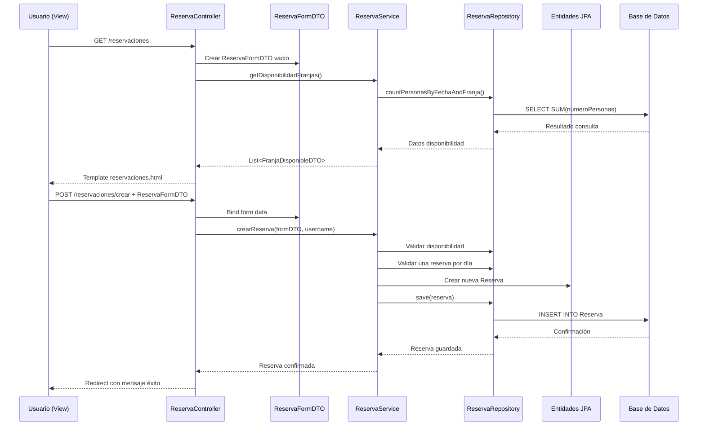
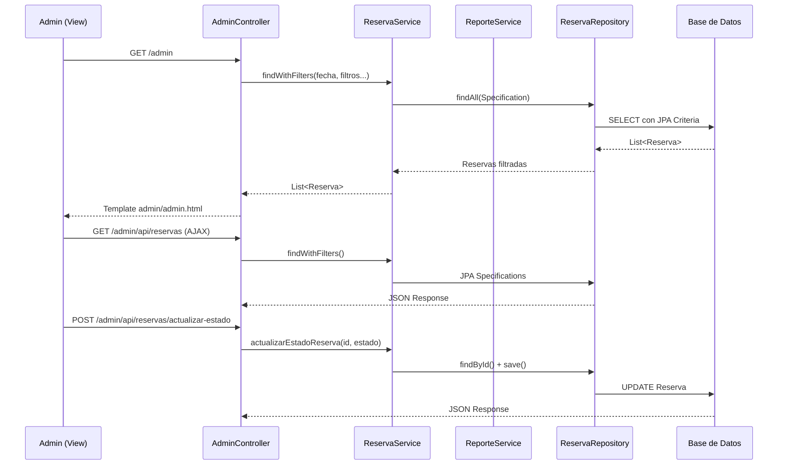
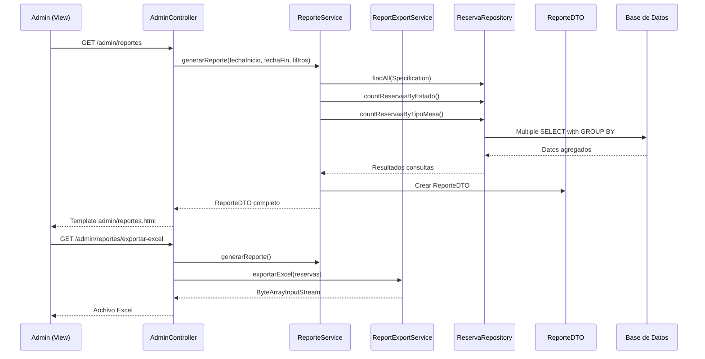

# Sistema de Reserva de Mesas - Restaurante Siete Sopas

## Descripción del Proyecto

Sistema web desarrollado en Spring Boot para la gestión de reservas de mesas en el restaurante "Siete Sopas". El sistema permite a los usuarios realizar reservas online y proporciona herramientas administrativas para la gestión y análisis de reservas.

## Tecnologías Utilizadas

- **Backend**: Spring Boot 3.x, Spring Security, Spring Data JPA
- **Base de Datos**: H2 Database (desarrollo)
- **Frontend**: Thymeleaf, Bootstrap 5, JavaScript
- **Herramientas**: Maven, Lombok
- **Reportes**: Apache POI (Excel), iText (PDF)

---

## Análisis del Flujo de Información - Patrones DAO, DTO y MVC

### Diagrama de Arquitectura MVC con Patrones DAO y DTO

```mermaid
graph TB
    subgraph "CAPA DE PRESENTACIÓN (View)"
        HTML["`**Templates HTML**
        - index.html
        - reservaciones.html
        - admin/admin.html
        - admin/reportes.html
        - login.html
        - perfilu.html`"]
        JS["`**JavaScript**
        - reserva-dinamica.js
        - AJAX Calls`"]
    end

    subgraph "CAPA DE CONTROL (Controller)"
        HC["`**HomeController**
        @GetMapping("/")`"]
        RC["`**ReservaController**
        @GetMapping("/reservaciones")
        @PostMapping("/reservaciones/crear")
        @GetMapping("/api/disponibilidad")`"]
        AC["`**AdminController**
        @GetMapping("/admin")
        @GetMapping("/admin/api/reservas")
        @PostMapping("/admin/api/reservas/actualizar-estado")`"]
        PC["`**ProfileController**
        @GetMapping("/perfil")
        @PostMapping("/perfil/actualizar")`"]
        AuthC["`**AuthController**
        @GetMapping("/login")
        @PostMapping("/register")`"]
    end

    subgraph "CAPA DE SERVICIO (Service/Business Logic)"
        RS["`**ReservaService**
        - crearReserva()
        - getDisponibilidadFranjas()
        - actualizarEstadoReserva()
        - crearReservaAnonima()`"]
        US["`**UsuarioService**
        - registrar()
        - actualizarPerfil()
        - cambiarContrasena()`"]
        RepS["`**ReporteService**
        - generarReporte()
        - findReservasForReport()`"]
        ExpS["`**ReportExportService**
        - exportarExcel()
        - exportarPdf()`"]
    end

    subgraph "CAPA DTO (Data Transfer Objects)"
        RFormDTO["`**ReservaFormDTO**
        - nombreCliente
        - correoCliente
        - telefonoCliente
        - fecha
        - numeroPersonas
        - idFranja
        - idTipoMesa`"]
        URDTO["`**UsuarioRegistroDto**
        - nombreCompleto
        - correo
        - telefono
        - usuario
        - contrasena`"]
        FDTO["`**FranjaDisponibleDTO**
        - idFranja
        - horario
        - disponible`"]
        DTMDTO["`**DisponibilidadTipoMesaDTO**
        - idTipoMesa
        - nombre
        - mesasDisponibles`"]
        RepDTO["`**ReporteDTO**
        - reservas
        - conteoPorEstado
        - conteoPorTipoMesa`"]
    end

    subgraph "CAPA DAO (Repository/Data Access)"
        RRepo["`**ReservaRepository**
        extends JpaRepository
        extends JpaSpecificationExecutor
        - countPersonasByFechaAndFranja()
        - countMesasByFechaAndFranja()
        - findByUsuarioAndFecha()
        - countReservasByEstado()`"]
        URepo["`**UsuarioRepository**
        extends JpaRepository
        - findByUsuario()
        - findByCorreo()`"]
        TMRepo["`**TipoMesaRepository**
        extends JpaRepository`"]
        CFRepo["`**ConfiguracionFranjaRepository**
        extends JpaRepository`"]
    end

    subgraph "CAPA DE ENTIDADES (Model/Entity)"
        REntity["`**Reserva**
        @Entity
        - idReserva
        - nombreCliente
        - correoCliente
        - fecha
        - numeroPersonas
        - estado
        - @ManyToOne Usuario
        - @ManyToOne TipoMesa
        - @ManyToOne ConfiguracionFranja`"]
        UEntity["`**Usuario**
        @Entity
        - idUsuario
        - nombreCompleto
        - correo
        - telefono
        - usuario
        - contrasena
        - rol`"]
        TMEntity["`**TipoMesa**
        @Entity
        - idTipoMesa
        - nombre
        - descripcion`"]
        CFEntity["`**ConfiguracionFranja**
        @Entity
        - idFranja
        - horario
        - capacidadPersonas
        - capacidadMesas`"]
    end

    subgraph "BASE DE DATOS"
        DB["`**H2 Database**
        - Usuarios
        - Reserva
        - TipoMesa
        - ConfiguracionFranja`"]
    end

    %% Flujo de datos
    HTML --> RC
    JS --> RC
    HTML --> AC
    HTML --> PC
    HTML --> AuthC
    
    RC --> RFormDTO
    PC --> URDTO
    AuthC --> URDTO
    AC --> RFormDTO
    AC --> RepDTO
    
    RC --> RS
    PC --> US
    AuthC --> US
    AC --> RS
    AC --> RepS
    AC --> ExpS
    
    RS --> FDTO
    RS --> DTMDTO
    RepS --> RepDTO
    
    RS --> RRepo
    US --> URepo
    RepS --> RRepo
    RS --> TMRepo
    RS --> CFRepo
    
    RRepo --> REntity
    URepo --> UEntity
    TMRepo --> TMEntity
    CFRepo --> CFEntity
    
    REntity --> DB
    UEntity --> DB
    TMEntity --> DB
    CFEntity --> DB

    classDef controllerClass fill:#e1f5fe
    classDef serviceClass fill:#f3e5f5
    classDef dtoClass fill:#fff3e0
    classDef repoClass fill:#e8f5e8
    classDef entityClass fill:#fce4ec
    classDef viewClass fill:#f1f8e9

    class HC,RC,AC,PC,AuthC controllerClass
    class RS,US,RepS,ExpS serviceClass
    class RFormDTO,URDTO,FDTO,DTMDTO,RepDTO dtoClass
    class RRepo,URepo,TMRepo,CFRepo repoClass
    class REntity,UEntity,TMEntity,CFEntity entityClass
    class HTML,JS viewClass
```

## Flujo de Información Detallado por Casos de Uso

### 1. Flujo de Creación de Reserva



### 2. Flujo de Gestión Administrativa



### 3. Flujo de Reportes y Análisis



## Análisis de Patrones Implementados

### **Patrón MVC (Model-View-Controller)**

- **Model**: Entidades JPA (`Usuario`, `Reserva`, `TipoMesa`, `ConfiguracionFranja`)
- **View**: Templates Thymeleaf (HTML + CSS + JavaScript)
- **Controller**: Spring Controllers (`ReservaController`, `AdminController`, etc.)

### **Patrón DAO (Data Access Object)**

- **Implementación**: Spring Data JPA Repositories
- **Ventajas**: 
  - Abstracción del acceso a datos
  - Consultas personalizadas con `@Query`
  - Soporte para JPA Specifications (consultas dinámicas)
  - Transacciones automáticas

### **Patrón DTO (Data Transfer Object)**

- **Propósito**: Transferencia de datos entre capas
- **Ejemplos**: `ReservaFormDTO`, `FranjaDisponibleDTO`, `ReporteDTO`
- **Ventajas**:
  - Desacoplamiento entre formularios y entidades
  - Validación específica por caso de uso
  - Optimización de transferencia de datos

## Características Técnicas del Sistema

### **Separación de Responsabilidades**

1. **Controllers**: Manejo de HTTP requests/responses
2. **Services**: Lógica de negocio y validaciones
3. **Repositories**: Acceso a datos y consultas
4. **DTOs**: Transferencia y transformación de datos
5. **Entities**: Representación del modelo de dominio

### **Gestión de Transacciones**

- Uso de `@Transactional` en servicios críticos
- Rollback automático en caso de errores
- Integridad referencial con relaciones JPA

### **API RESTful para Interactividad**

- Endpoints AJAX para disponibilidad dinámica
- Filtrado en tiempo real de reservas
- Actualizaciones asíncronas de estado

---

## Funcionalidades Principales

### Para Usuarios
- Registro e inicio de sesión
- Reserva de mesas con selección de fecha, hora y tipo de mesa
- Gestión de perfil personal
- Visualización del menú del restaurante

### Para Administradores
- Panel de gestión de reservas
- Creación de reservas anónimas (para clientes en local)
- Filtrado avanzado de reservas
- Generación de reportes con gráficos
- Exportación de datos a Excel y PDF
- Actualización de estados de reservas

## Reglas de Negocio

1. **Disponibilidad**: Sistema de verificación en tiempo real basado en capacidad por franja horaria
2. **Límite de reservas**: Un usuario registrado puede hacer máximo una reserva por día
3. **Capacidad**: Máximo 25 personas por reserva
4. **Validación del 70%**: Sistema de control de ocupación para optimizar el uso de mesas

## Instalación y Ejecución

### Prerrequisitos
- Java 17 o superior
- Maven 3.6+

### Pasos para ejecutar
1. Clonar el repositorio
2. Navegar al directorio del proyecto
3. Ejecutar: `mvn spring-boot:run`
4. Acceder a: `http://localhost:8080`

### Usuarios por defecto
- **Admin**: usuario: `admin` / contraseña: `admin123`
- **Usuario**: usuario: `user` / contraseña: `user123`

## Estructura del Proyecto

```
src/
├── main/
│   ├── java/
│   │   └── com/example/demo/
│   │       ├── Controller/     # Controladores MVC
│   │       ├── Services/       # Lógica de negocio
│   │       ├── Repository/     # Acceso a datos (DAO)
│   │       ├── Entities/       # Entidades JPA (Model)
│   │       ├── dto/           # Data Transfer Objects
│   │       └── security/      # Configuración de seguridad
│   └── resources/
│       ├── templates/         # Vistas Thymeleaf
│       ├── static/           # Recursos estáticos
│       └── application.properties
```

Este sistema demuestra una implementación efectiva de los patrones MVC, DAO y DTO, proporcionando una arquitectura escalable y mantenible para la gestión de reservas de restaurante.
